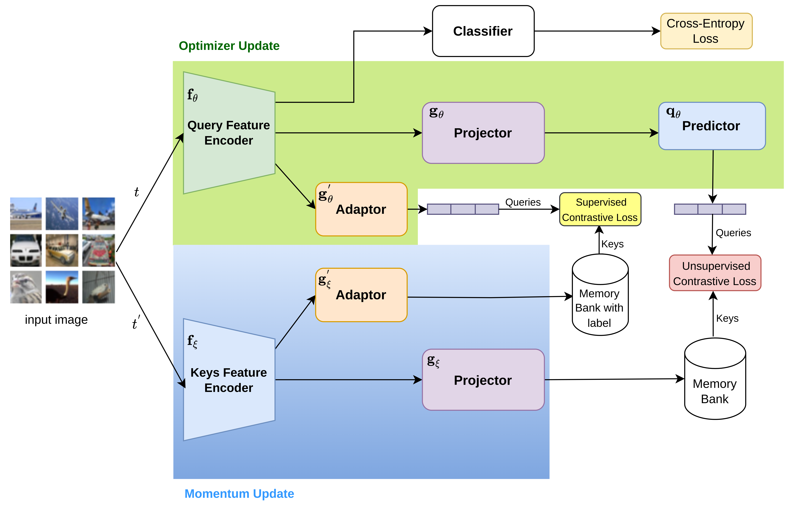

# sMoBYAL
## Our framefork pipline


The fully contrastive learning framework for Active Learning.
Please install the required libraries from requirements.txt
Pip install requirements:
```
pip install -r requirements.txt
```
To run sMoBYAL on CIFAR-10 (also CIFAR-100/SVHN/FashionMNIST): 
```
python main_ssl.py -d cifar10 -m mobyv2al
```
